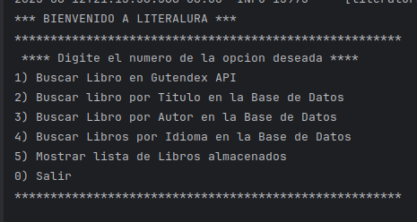
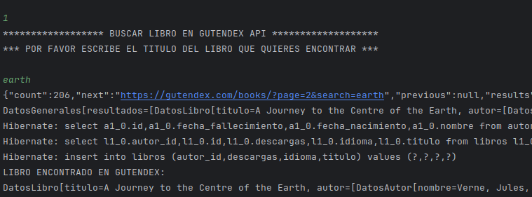
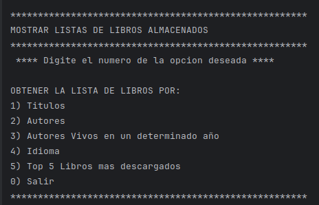
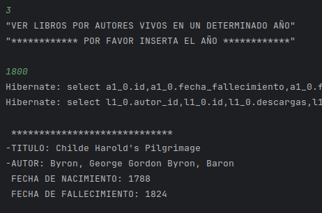

# Challenge ONE
## Literalura

Este proyecto es una aplicación desarrollada en **Java con Spring Boot** como parte del programa **Oracle Next Education (ONE)**. La aplicación consulta información de libros desde la API pública [Gutendex](https://gutendex.com/) y los almacena automáticamente en una base de datos **PostgreSQL** llamada `literaluradb`.

## Características

- Consulta automática a la API de Gutendex al buscar un libro por primera vez.
- Almacenamiento automático del libro en la base de datos PostgreSQL.
- Búsquedas personalizadas de libros desde la base de datos por:
    - Título
    - Nombre del autor
    - Idioma
- Listados personalizados ordenados por:
    - Título
    - Nombre del autor
    - Autores vivos en un año determinado
    - Idioma
    - Los 5 libros más descargados

## Tecnologías usadas

- **Java + Spring Boot**
- **JPA con consultas derivadas y JPQL**
- **PostgreSQL**
- **API Gutendex**
- **Archivos `.env` para manejo de variables de entorno**

## Dependencias utilizadas

- `spring-boot-starter`
- `spring-boot-starter-data-jpa`
- `spring-boot-starter-test`
- `postgresql`
- `jackson-databind` (versión 2.19.2)
- `java-dotenv` (versión 5.2.2)

## Imagenes de la consola
| Menu inicial                          |
|---------------------------------------|
|  |

| Resultado de Busqueda de Libro          |
|-----------------------------------------|
|  |

| Menu para listar libros de la Base de Datos |
|---------------------------------------------|
|          |

| Resultado de Libros por Autores Vivos |
|---------------------------------------|
|  |

## Autora
Desarrollado por **Diana Campos** como parte del programa **Oracle Next Education**.